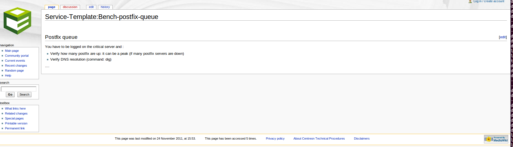

Definition
==========

A procedure is basically a technical documentation allowing operators
to know what to do when an alert is raised in Centreon.

Procedures can be of different natures:

- describe actions to solve a problem
- escalate the issue to antother team
- open a support ticket
- warn users that a specific service is down

A procedure can be defined for an host or a service.

