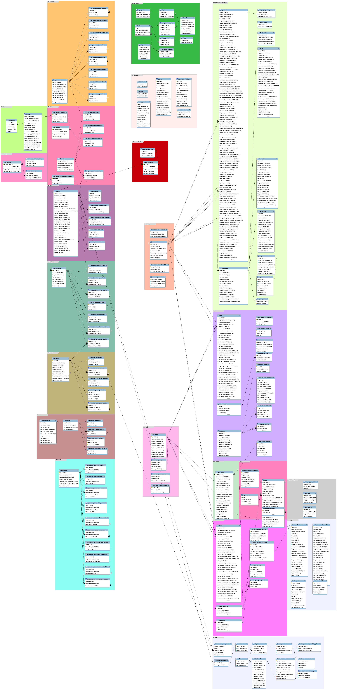

.. _performance:

=============================
Centreon platform performance
=============================

This is a guide on improving Centreon's performance

*********
Databases
*********

The database server is one of the central components of Centreon. Its
performance has a direct impact on the end user application's speed. Centreon
uses two or three databases depending on your monitoring broker:

 * ``centreon`` -- Storing metadata
 * ``centreon_storage`` -- Real-time monitoring and history

Indexes
=======

Databases use indexes to speed up queries. In case indexes are missing queries
are executed slower.

.. _synchronizing-indexes:

Synchronizing indexes
*********************

Starting with Centreon ``2.4.0`` for each release, index information files are
generated. They are found in ``data`` folder usually located next to the
``bin`` or ``www`` folders. They are JSON files and there is one for each database:

 * ``centreonIndexes.json`` -- Indexes for ``centreon`` database
 * ``centreonStorageIndexes.json`` -- Indexes for ``centreon_storage`` database
 * ``centreonStatusIndexes.json`` -- Indexes for ``centreon_status`` database

Check if your database is desynchronized::

  $ cd CENTREONBINDIR
  $ ./import-mysql-indexes -d centreon -i ../data/centreonIndexes.json

If any differences are detected you can synchronize your database. The process
usually takes several minutes BUT **if your database contains a lot of data and no
index exists the process may take up to 2 hours**. Make sure you have enough free
space on the disk because indexes may require a lot of space::

  $ ./import-mysql-indexes -d centreon -i ../data/centreonIndexes.json -s

.. note::

   **Indexes used by foreign keys cannot be synchronized.**

   ``-s`` or ``--sync`` options should be used in order to alter the
   database. If you need to specify the username and/or password you can use ``-u`` and
   ``-p`` options respectively.

InnoDB optimizations
====================

This section is not documented yet.

Databases schema
================

Centreon database schema can be view here :

Centreon storage database schema can be view here :

.. image:: ../database/centreon-storage.png

*********
RRDCacheD
*********

RRDCacheD is a process to reduce disk I/O during the update of performance's graphs and status' graphs. The RRDCacheD
process is loaded by the Centreon Broker module and mutualise I/O disques instead of recording one by one the data from
the collect.

Installation
============

Execute the following command: ::

    # yum install rrdtool-cached

Configuration
=============

Main settings
*************

Edit the **/etc/sysconfig/rrdcached** file and complete information::

    # Settings for rrdcached
    OPTIONS="-m 664 -l unix:/var/rrdtool/rrdcached/rrdcached.sock -s rrdcached -b   /var/rrdtool/rrdcached -w 3600 -z 3600 -f 7200"
    RRDC_USER=rrdcached

.. note::
    The order of setting is pretty important. If **-m 664** is define before **-l unix:/var/rrdtool/rrdcached/rrdcached.sock** option then rights will be incorrect on socket.

Options are following one:

+--------+-----------------------------------------------------------------------------------+
| Option | Description                                                                       |
+========+===================================================================================+
| -w     | Data are written every x seconds on disk (3600s in example represent 1h)          |
+--------+-----------------------------------------------------------------------------------+
| -z     | Should be less than **-w** option. RRDCacheD uses a range value from [0:-z] to do |
|        | not write in RRDs in same time.                                                   |
+--------+-----------------------------------------------------------------------------------+
| -f     | Timeout in cache before write data to disk.                                       |
+--------+-----------------------------------------------------------------------------------+

.. note::
    Please modify values with your needs.

Creating the service startup file
*********************************

Replace the default **/usr/lib/systemd/system/rrdcached.service** init script: ::

    # cp /usr/share/centreon/examples/rrdcached.systemd /usr/lib/systemd/system/rrdcached.service

Execute following commands: ::

    mkdir -p /var/rrdtool
    useradd rrdcached -d '/var/rrdtool/rrdcached' -G centreon-broker,centreon -m
    chmod 775 -R /var/rrdtool

Groups configuration
********************

Create groups using commands: ::

    # usermod -a -G rrdcached centreon-broker
    # usermod -a -G rrdcached apache
    # usermod -a -G centreon rrdcached
    # usermod -a -G centreon-broker rrdcached

Restart process: ::

    # systemctl daemon-reload
    # systemctl enable rrdcached
    # systemctl start rrdcached

Check the status of the process: ::

    # systemctl status rrdcached
    ● rrdcached.service - Data caching daemon for rrdtool
       Loaded: loaded (/etc/systemd/system/rrdcached.service; disabled; vendor preset: disabled)
       Active: active (running) since ven. 2018-10-26 10:14:08 UTC; 39min ago
         Docs: man:rrdcached(1)
     Main PID: 28811 (rrdcached)
       CGroup: /system.slice/rrdcached.service
               └─28811 /usr/bin/rrdcached -m 664 -l unix:/var/rrdtool/rrdcached/rrdcached.sock -s rrdcached -b /var/rrdtool/rrdcached -w 7200 -f 14400 -z 3600 -p /var/rrdtool/rrdcached/rrdcached.pid
    
    oct. 26 10:14:08 demo-front rrdcached[28811]: starting up
    oct. 26 10:14:08 demo-front systemd[1]: Started Data caching daemon for rrdtool.
    oct. 26 10:14:08 demo-front rrdcached[28811]: listening for connections
    oct. 26 10:14:08 demo-front systemd[1]: Starting Data caching daemon for rrdtool...

Centreon web configuration
**************************

Go to **Configuration > Pollers > Broker configuration** menu, select the broker inserting data into RRD files then in
the **Output** tab enable process and set unix socket path:

* Enable RRDCached: unix
* RRDCacheD listening socket/port: /var/rrdtool/rrdcached/rrdcached.sock

Enable process and set unix socket path:

.. image:: /images/faq/rrdcached_config.png
    :align: center

.. warning::
    Instead of configuration was made into **Administration** you need to generate and export configuration of central
    server and restart cbd process to apply changes.

.. image:: /images/faq/rrd_file_generator.png
    :align: center

Centreon web interface
**********************

RRDCacheD don't update performances graphs in real time. If a blank range appears on right of performances graphs it
means that cache are not yet written to disk.

.. warning::
    If the **RRDCacheD process crash** (in theory because it's a stable process) data will be lost! It is not possible
    to get data unless rebuild all graphs from Centreon web.
