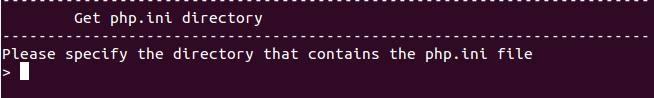
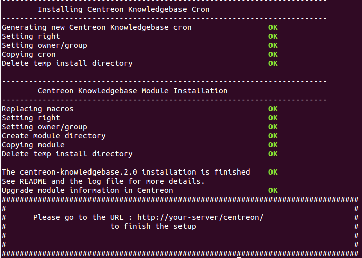

.. _install_from_sources:

===============
Package install
===============

Choose the package to use depending on the PHP version you use:

+--------------------+------------------------------------------+
|PHP version         | Package's name                           |
+====================+==========================================+
|< 5.3               | centreon-knowledgebase-2.0.0-php5.tar.gz |
+--------------------+------------------------------------------+
|5.3                 | centreon-knowledgebase-2.0.0-php53.tar.gz|
+--------------------+------------------------------------------+

Then follow the procedure below.

.. warning::

   Follow the procedure as "root" user.

Decompress the package::

  $ tar xzf centreon-knowledegebase-2.0.0-php5.tar.gz
  $ cd centreon-knowledegebase-2.0.0-php5/
  $ ./install -i

Specify the directory where *instCentWeb.conf* is located:

.. image:: ../_static/installation/install_sh_instwebconf.png
    :align: center

Then specify where *php.ini* is located:

If the installation successfully ends, continue to next step, otherwise
restart the process from ``./install -i``:

