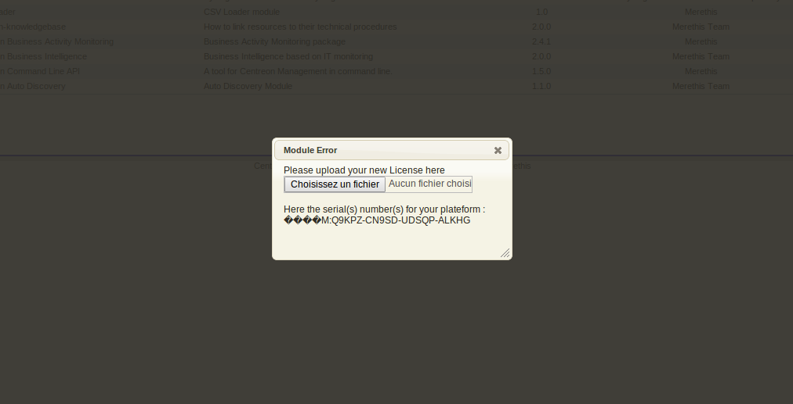

.. _install_license:

=======
License
=======

A license file named *merethis_lic.zl* is provided by Merethis.

***************************************
License centreon front end installation
***************************************

Go to *Administration > Modules*:

.. image:: ../_static/installation/license_modules_view.png
    :align: center

Click on the Red icon to open the license upload form:

If successfull, that window will appear. Read the warning message
shown and fix the issue:

.. image:: ../_static/installation/license_success.png
    :align: center

**************************
License shell installation
**************************

Copy this file on the monitoring server and install it::

  $ cp merethis_lic.zl /usr/share/centreon/www/modules/centreon-knowledgebase/license/
  $ chown apache.apache /usr/share/centreon/www/modules/centreon-knowledgebase/license/merethis_lic.zl
  $ /etc/init.d/apache2 restart

