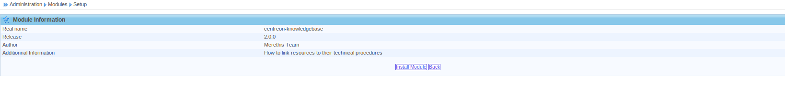
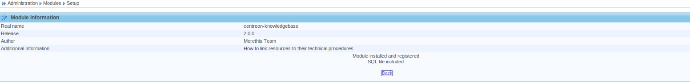
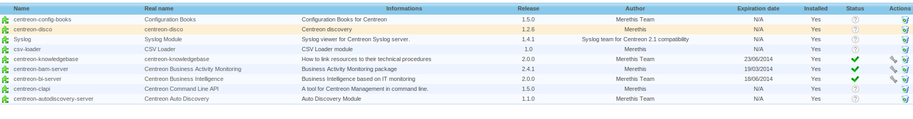

.. _install_by_web_interface:

===========
Web install
===========

To complete the installation, connect to Centreon and go to *Administration > Modules*.

Click on the icon |installicon| to start the installation of the modules.

.. |installicon| image:: ../_static/installation/centreon-module-install-icon.gif

Click on *Install module* to install the module.

When the module is installed, you can click on back to go back to the module page.

Here you can see that the module is fully installed.

