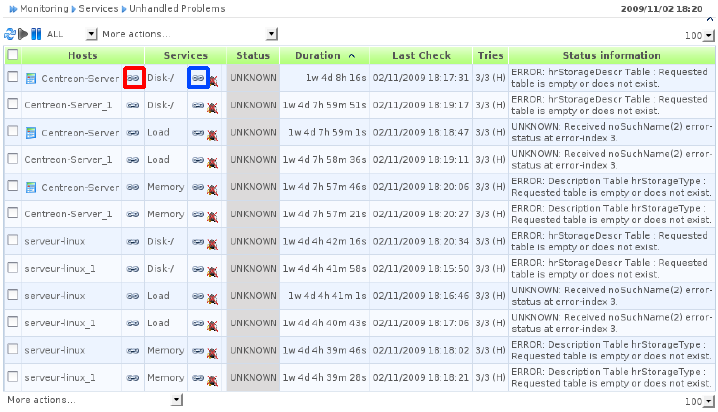

.. _wiki-page-link:

Link from monitoring front end
==============================

The technical procedure is available in Centreon front-end through a
link icon. Check the following screenshot to locate the icon:

By clicking on link icon, the user is redirected to the corresponding
procedure. If the link icon is on the right of a host name, the wiki
page containing the procedure for the host will be displayed. If the
link icon is on the right of a service name, the wiki page containing
the procedure for the service will be displayed. See previous
illustration with red and blue squares.

Synchronization
---------------

There's a cron job that updates hosts, services and hosts/services
templates configuration if it finds a new entry in the wiki index.

For example, if you create a page in the wiki using the usual pattern
(ex: ``Host:Centreon-Server`` or ``Service:Centreon-Server Disk-/``),
the cron will find the matching object in Centreon configuration. And
it will add the link to the page in the *URL* field of object's
extented information.
