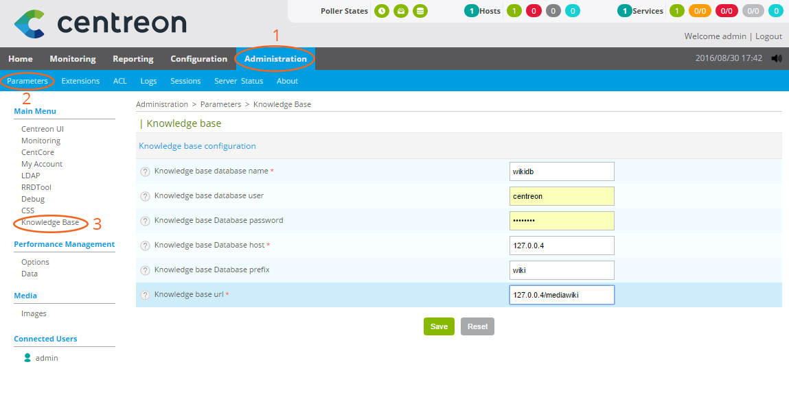

================================
Configuration de l'accès au wiki
================================

Afin d'utiliser *Centreon Knowledge Base*, vous devez le configurer pour qu'il accède à la base de données du wiki.

Pour cela rendez-vous dans **Administration  >  Parameters  >  Knowledge Base** et renseignez le formulaire.

