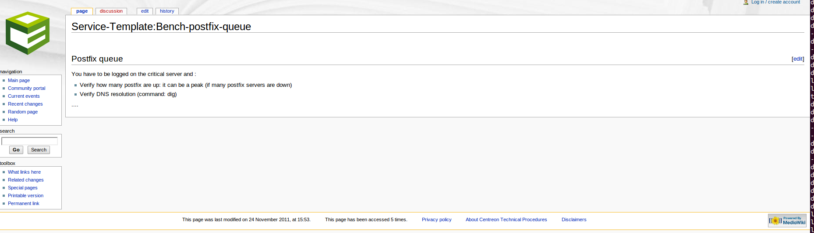

Définition
==========

Une procédure est une documentation technique et/ou fonctionnelle qui met à la disposition des exploitants 
un mode opératoire dans le cadre du traitement d'une alerte.

Le contenu d'une procédure peut être d'ordre général ou spécifique:

- Décrire les actions nécessaires à la résolution d'un problème.
- Informer de l'existence d'une consigne particulière (temporaire ou permanente).
- ...

Une procédure peut être associée à un hôte ou un service.

