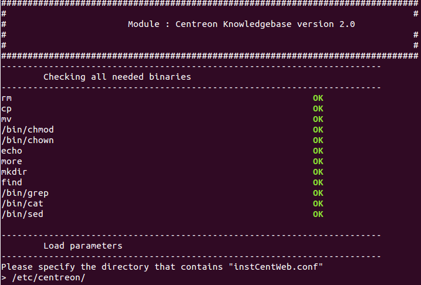

.. _install_from_sources:

============================
Installation par les sources
============================

Choisir le paquet à utiliser en fonction de la version de PHP utilisée:

+--------------------+------------------------------------------+
| PHP version        | Paquet                                   |
+====================+==========================================+
| < 5.3              | centreon-knowledgebase-2.0.0-php5.tar.gz |
+--------------------+------------------------------------------+
| 5.3                | centreon-knowledgebase-2.0.0-php53.tar.gz|
+--------------------+------------------------------------------+

Suivre ensuite la procédure suivante.

.. attention::

   Exécuter la procédure en tant qu'utilisateur "root".

Décompresser le paquet::

  $ tar xzf centreon-knowledegebase-2.0.0-php5.tar.gz
  $ cd centreon-knowledegebase-2.0.0-php5/
  $ ./install -i

Spécifier le répertoire ou *instCentWeb.conf* est localisé:

Spécifier ensuite le répertoire ou *php.ini* est localisé:

.. image:: ../_static/installation/install_sh_phpini.png
    :align: center

Si l'installation s'effectue correctement, poursuiver, sinon redémarrer 
la procédure depuis ``./install -i``:

.. image:: ../_static/installation/install_sh_complete.png
    :align: center

