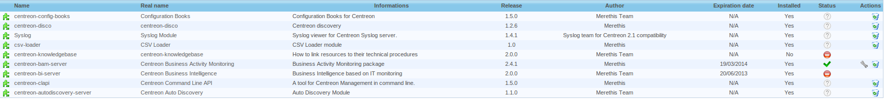
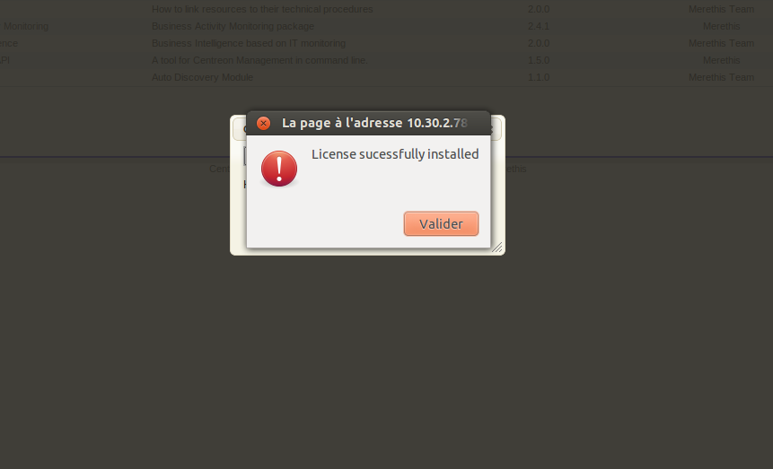

.. _install_license:

=======
Licence
=======

Un fichier de licence *merethis_lic.zl* est fourni par Merethis.

******************************************************
Installation de la licence depuis l'interface Centreon
******************************************************

Accéder au menu *Administration > Extensions*:

Cliquer sur l'icône rouge pour ouvrir le formulaire d'upload de licence:

.. image:: ../_static/installation/license_prompt_window.png
    :align: center

Si l'opération fonctionne cette fenêtre apparaît.
En cas de problème tentez de le résoudre ou faites appel au support.

******************************************
Installation de la licence depuis le shell
******************************************

Copier le fichier sur le serveur Centreon et installer le::

  $ cp merethis_lic.zl /usr/share/centreon/www/modules/centreon-knowledgebase/license/
  $ chown apache.apache /usr/share/centreon/www/modules/centreon-knowledgebase/license/merethis_lic.zl
  $ /etc/init.d/apache2 restart

