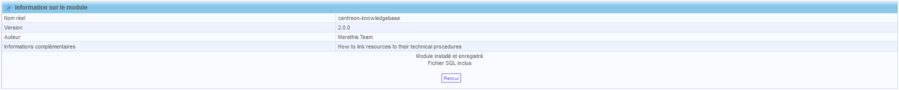
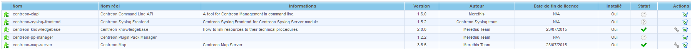

.. _install_by_web_interface:

================
Installation Web
================

Afin de compléter l'installation, connectez vous à l'interface Centreon.

Accéder au menu *Administration > Extensions*:

Cliquer sur l'icône |installicon| pour lancer l'installation du module.

Cliquer sur *Installer le module* pour installer le module.

.. image:: ../_static/installation/web_install_page.png
    :align: center

Une fois le module installé cliquer sur retour pour retourner à la page de configuration des extensions.

Vous pouvez voir sur cette page l'état du module.

